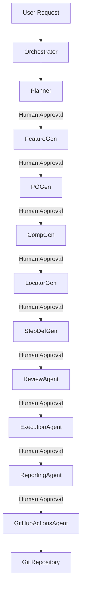

# Architecture Template

**Purpose**  
Provide a high‑level architectural overview of the Cline‑based automation platform, documenting layers, agents, skills, and data flow.

**Template**
```markdown
# Architecture Overview

## 1. Orchestrator Layer
- **Master Orchestrator** (`orchestrator.md`): Receives user requests, selects agents, validates outputs, and manages human‑approval checkpoints.

## 2. Domain Layer
- **Major Agents** – each encapsulating a distinct responsibility:
  - Planner Agent
  - Requirement Agent
  - Feature Generator
  - Page Object Generator
  - Component Generator
  - Locator Generator
  - Assertion Generator
  - Step Definition Generator
  - Hooks Generator
  - Fixture Generator
  - Test Data Generator
  - API Helper Agent
  - Review Agent
  - Refactoring Agent
  - Debugging Agent
  - Reporting Agent
  - Documentation Agent
  - GitHub Actions Agent
  - Execution Agent
  - Maintenance Agent

## 3. Sub‑Agent Layer
- Each major agent has focused sub‑agents (e.g., `locator-builder`, `method-builder`, `component-builder`, `risk-analyzer`, etc.) that perform granular tasks.

## 4. Skills Layer (`.cline/skills/`)
- Reusable, language‑agnostic capabilities grouped by domain:
  - `playwright/`, `typescript/`, `cucumber/`, `gherkin/`, `page-object-model/`, `component-object-model/`, `locators/`, `assertions/`, `fixtures/`, `hooks/`, `test-data/`, `accessibility/`, `api/`, `allure/`, `github-actions/`, `debugging/`, `logging/`, `refactoring/`, `review/`, `performance/`, `security/`.

## 5. Templates Layer (`.cline/templates/`)
- Boilerplate files for artefacts:
  - Feature, Scenario, Scenario Outline, Page Object, Component, Fixture, Hooks, Test Data, README, Architecture.

## 6. Prompts Layer (`.cline/prompts/`)
- Reusable prompts that drive agents to generate artefacts (e.g., `generate-feature.md`, `generate-page.md`, `generate-hooks.md`, etc.).

## 7. Rules Layer (`.clinerules/`)
- Governing documents for architecture, coding standards, locator strategy, naming conventions, folder structure, CI/CD workflow, human‑approval process, and security.

## 8. Infrastructure Layer
- GitHub Actions pipelines, Allure reporting configuration, Husky pre‑commit hooks, ESLint & Prettier setup.

## Data Flow Example


**Guidelines**
- Keep each layer independent; communicate via well‑defined JSON contracts.
- Follow SOLID, DRY, KISS, and YAGNI principles.
- All agents must request human approval before any major change (see `.clinerules/human-approval.md`).
- Use the provided `.clinerules` for naming, folder layout, and coding standards.

**Usage**  
The orchestrator can render this file at `architecture.md` in the repository root, and the Documentation Agent updates it as the platform evolves.
```

**Guidelines**
- Ensure the diagram syntax is compatible with Mermaid (used in many markdown renderers).
- Update layer descriptions as new agents or skills are added.
- Maintain alignment with `.clinerules/architecture.md` and other rule files.

**Usage**  
The Documentation Agent writes this file to the repository root (`architecture.md`) and updates it during maintenance cycles.